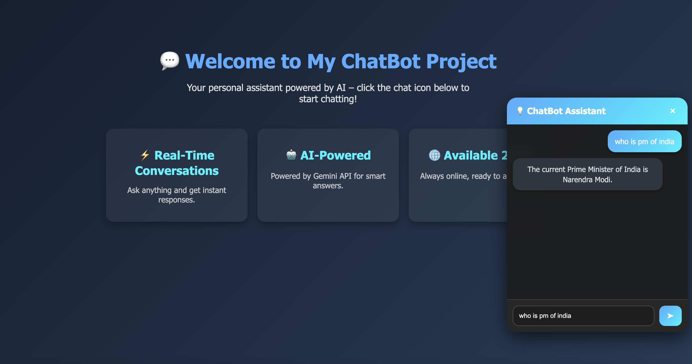

# 💬 ChatBot Project

A simple floating chatbot widget built with **HTML, CSS, and JavaScript**, powered by **Google Gemini API** for AI responses.

## 🚀 Features
- Floating chat icon (opens/closes chatbot window)
- User & bot messages styled like a real chat
- "Bot is typing..." indicator
- Connected to Gemini API for smart responses

---

## 🖼️ Screenshot




---

## ⚡ Setup

1. Clone this repository:
   ```bash
   git clone https://github.com/110059/chatbot.git
   cd chatbot

   open index.html
